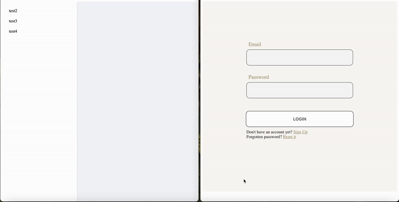

# **ChatHubApp**

## 🌐 Real-Time Chat Application

**ChatHubApp** is a  real-time messaging platform designed to facilitate seamless communication for private chats.

---

## 🎯 **Features**

- **🔒 Private Chat**: Engage in secure, one-on-one real-time conversations.  
- **🚀 Real-Time Messaging**: Enjoy fast and responsive messaging with low latency.  

---

## 🛠️ **Tech Stack**

### **Backend**
- **ASP.NET Core SignalR**: Powers the real-time communication engine, ensuring low-latency, bidirectional data exchange for seamless messaging.

### **Frontend**
- **Angular**: Provides a dynamic and interactive user interface with a responsive design for both desktop and mobile devices.

### **Database**
- **Redis**: Ensures fast message retrieval and scalability by storing chat messages in memory.  
- **PostgreSQL**: Securely manages user information, including account credentials and profile details, while maintaining consistency and reliability.

---

## 📸 **Demonstration**

Below is a quick preview of the application in action:  

  

> *Real-time chat experience showcasing private messaging with sleek responsiveness.*

---

## 🛡️ **Security and Scalability**

- **User Authentication**: The application utilizes a robust and secure login system based on **JWT (JSON Web Tokens)** for authentication. User credentials are securely encrypted using industry-standard hashing algorithms before being stored in the **PostgreSQL** database. This ensures that passwords are never stored in plain text, providing an additional layer of protection. Tokens are securely signed and include expiration times to enhance security, preventing unauthorized access and token misuse.
- **Scalable Architecture**: Redis and SignalR ensure the application can handle high traffic without performance degradation.

---

## 🚀 **Future Enhancements**

- **🖼️ Media Sharing**: Enable users to share images, videos, and documents.  
- **👥 Group Chatting**: Enable users to create group chats and share messages.
- **🔔 Notifications**: Receive instant alerts for new messages, even when you're not actively in the chat.  
- **💬 User Status**: See who's online or offline for improved interaction and awareness.  
---

## 📧 **Contact**

For questions, feature requests, or collaboration opportunities, feel free to reach out:  

- **GitHub**: [aleksandarm001](https://github.com/aleksandarm001/chat-hub-app)  
- **Email**: [aleksandar.marinkovic6366@gmail.com](mailto:aleksandar.marinkovic6366@gmail.com)  
